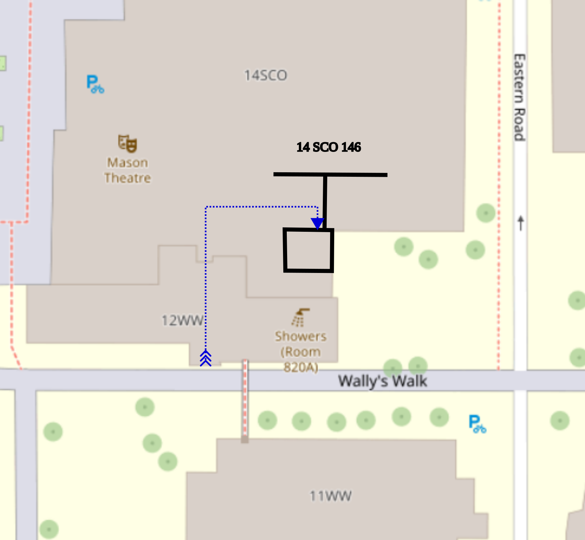

Workshop to be held at Macquarie University Thu 24th Sep&ndash;Fri 25th Sep 2026 in 14 Sir Christopher Ondaatje Avenue (14SCO) Room 146.

# Schedule

## Thu

-   10:15-10:30 OPENING
-   10:30-12:30 CHAIR: Jihye Lee
-   10:30-11:10 Simon Goodwin
-   11:30-12:10 Devesh Rajpal
-   12:30-14:00 LUNCH
-   14:00-15:30 CHAIR: Owen Dearricott
-   14:00-14:40 Qiyu Zhou
-   14:50-15:30 Max Orchard
-   15:30-16:00 AFTERNOON TEA
-   16:00-17:30 CHAIR: Kwok Kun Kwong
-   16:00-16:40 Tien Dat Dinh
-   16:50-17:30 Owen Dearricott

## Fri

-   0:30-12:30 CHAIR: Devesh Rajpal
-   0:30-11:10 Jihye Lee
-   1:30-12:10 Kwok Kun Kwong
-   2:30-14:00 LUNCH
-   4:00-15:30 CHAIR: Max Orchard
-   4:00-14:40 Vindula Kumaranayake Magurawalage
-   4:50-15:30 Elliot Mabbutt
-   5:30-16:00 AFTERNOON TEA
-   6:00-17:00 CHAIR: Simon Goodwin
-   6:00-16:40 Alexander Bednarek

# Abstracts

## Jihye Lee (Macquarie)

-   **Title:** Isoperimetric profile comparisons under integral Ricci curvature bounds

-   **Abstract:** The isoperimetric profile of a Riemannian manifold describes the least boundary area needed to enclose a prescribed volume. Classical comparison theorems relate this profile to that of a model space under pointwise lower bounds on Ricci curvature. In this talk, I will discuss quantitative comparison estimates under integral Ricci curvature bounds, extending results of Morgan–Johnson and Ni–Wang.

## Simon Goodwin (Aukland)

-   **Title:** First integrals, Killing scales and Tractors

-   **Abstract:** The Killing equation and its generalisations for Killing tensors are important for the study of symmetry, structure deformations, and for separation of variables for the Hamilton-Jacobi equation and as symmetries of the Laplacian equation. These Killing equations arise as operators in BGG complexes. Solutions of BGG equations and their tractor prolongations are known to be central to finding first integrals for distinguished curves, such as unparameterised geodesics in projective manifolds. The Killing equations have natural, invariant conformal weakenings, solutions of which are conformal Killing tensors. One can ask whether a conformal Killing tensor actually arises from a Killing tensor for a given metric in the conformal class. When this occurs, the metric is called a Killing scale. For conformal Killing 2-tensors, the Killing scale condition is a reformulation of the Bertrand-Darboux equation, ubiquitous in the study of Hamiltonian systems on Riemannian manifolds. We take the question of Killing scales, apply this to a natural family of Hamiltonians on projectively flat manifolds and use conformal tractor calculus to construct and classify maximally superintegrable Hamiltonians in the family. The overall story demonstrates a beautiful interaction of mechanics, geometry, and linear algebra.

    This is joint work with Rod Gover, Thomas Leistner, and Jonathan Kress

## Alexander Bednarek (USyd)

-   **Title:** On Miyaoka-Yau Inequalities and Weil-Petersson Metrics

-   **Abstract:** The classical Miyaoka-Yau inequality is a constraint on Kahler-Einstein manifolds where equality is equivalent to being a complex space form. We discuss how the Kahler-Ricci flow can provide several extensions of the inequality to non-KE manifolds, and the connection with the slope stability of the holomorphic tangent bundle. Finally, we display a connection with the Weil-Petersson metric, a form measuring the variation of complex structures, and that equality in the extended Miyaoka-Yau inequality is equivalent to being a holomorphic fibre bundle. This is recent work: arXiv.2609.06451.

## Kwok Kun Kwong (UoW)

-   **Title:** An improved volume bound under Ricci and scalar curvature lower bounds

-   **Abstract:** The Bishop–Gromov volume comparison theorem implies that if the Ricci curvature of a closed Riemannian manifold is bounded below by that of the unit sphere, then its total volume is bounded above by the volume of the sphere. It is natural to ask whether this estimate can be improved if one additionally assumes a stronger lower bound on the scalar curvature. This question is closely related to a conjecture of Bray.

    In this talk, I will explain a volume bound that takes into account the full spectrum of the Ricci curvature. As a consequence, one obtains an improved upper bound for the total volume which agrees, to first order, with the bound predicted by Bray’s conjecture. If time permits, I will also discuss an averaged volume comparison for metric balls of arbitrary radius.

## Owen Dearricott (LaTrobe)

-   **Title:** Killing tensors on complex and quaternionic projective spaces

-   **Abstract:** A covariant symmetric tensor field is said to be Killing if the symmetrisation of its covariant derivative vanishes. The Killing tensors on standard spheres were classified in the 1980s and are decomposable; namely, they consist of sums of symmetric products of rank 1 Killing tensors dual to Killing fields. Recently, Eastwood proved that the same is true on complex projective space.

    In this talk we corroborate Eastwood's result by different means. Namely via the Riemannian submersion given by a Hopf fibration and the classical invariant theory of Hermann Weyl. We go on in this vein to classify the Killing tensors on quaternionic projective space to be generated by rank 1 Killing tensors dual to Killing fields and the quadratic Killing tensors found by Matveev and Nikolayevsky in 2024.

    This is joint work with Yuri Nikolayevsky.

## Qiyu Zhou (ANU)

-   **Title:** High-Codimension Mean Curvature Flow with One Spacelike Codimension

-   **Abstract:** In this talk, I will present the spacelike-convex theory and new convexity and cylindrical estimates for high-codimension mean curvature flow with one spacelike codimension. These results are inspired by the argument of Haslhofer&ndash;Kleiner, but use a different and more flexible approach that extends naturally to the high-codimension setting considered here. This is a joint work with Ben Andrews.

## Max Orchard (UQ)

-   **Title:** TBA

-   **Abstract:** TBA

## Tien Dat Dinh (UoW)

-   **Title:** Liouville type results for super-p-biharmonic submanifolds of Euclidean space

-   **Abstract:** Chen’s Conjecture is a longstanding conjecture in the field of Geometric Analysis. It states that every biharmonic immersion into Euclidean space is minimal. Though remains unsolved, Chen’s conjecture has opened many active research directions regarding biharmonic and$p$-biharmonic maps. In this talk, we introduce a notion of weak super-$p$-biharmonic immersions into Euclidean space and discuss rigidity results of such proper immersions with an integrability condition. This presentation is based on a joint work with Glen Wheeler and Nguyen Thac Dung.

## Devesh Rajpal (ANU)

-   **Title:** Uniqueness of Lp-Minkowski problem near the affine exponent

-   **Abstract:** We prove dimensional C0 estimates for solutions of the Lp-Minkowski problem in the entire supercritical range. This implies a spectral gap of the Brunn-Minkowski operator for the Lp Minkowski solutions. Furthermore, following methods from Ivaki-Milman and Du's results, this allows us to prove uniqueness of the Lp Minkowski problem in the supercritical range near the affine exponent p = -n-1 and importantly without any symmetry assumption.

## Elliot Mabbutt (UoW)

-   **Title:** The Graphical Wound Healing Flow with Neumann Boundary

-   **Abstract:** The wound healing flow is a geometric flow similar to the curve shortening flow, but with a forcing term. A family of curves $\gamma$ following the wound healing flow has evolution $\gamma_t=(\sigma_1k+\sigma_2)N$ for $\sigma_1>0$ and $\sigma_2$ constants, $k$ the scalar curvature and $N$ the anticlockwise unit normal.

    We focus on the case of a curve between two parallel lines, with 90-degree Neumann boundary conditions, where the initial curve $\gamma_0$ can be written as a graph in its first component. We translate the flow equation into a quasilinar PDE, and then prove global existence and uniqueness, and convergence of the solution to a horizontal line translating in time.

## Vindula Kumaranayake Magurawalage (UoW)

-   **Title:** Rigidity Theorems in General Relativity

-   **Abstract:** Rigidity theorems show that, under symmetry or asymptotic assumptions, solutions to the Einstein vacuum equations collapse to a handful of distinguished metrics. This talk gives modern, self-contained proofs of four classical results: Birkhoff's theorem, Lichnerowicz's theorem, Robinson's generalisation of Israel's uniqueness theorem, and the Boucher–Gibbons–Horowitz rigidity theorem for anti-de Sitter spacetime, and highlights a unifying template underlying the last two: constructing a divergence identity, integrating it between carefully chosen hypersurfaces, and using positivity to force curvature obstructions to vanish.
